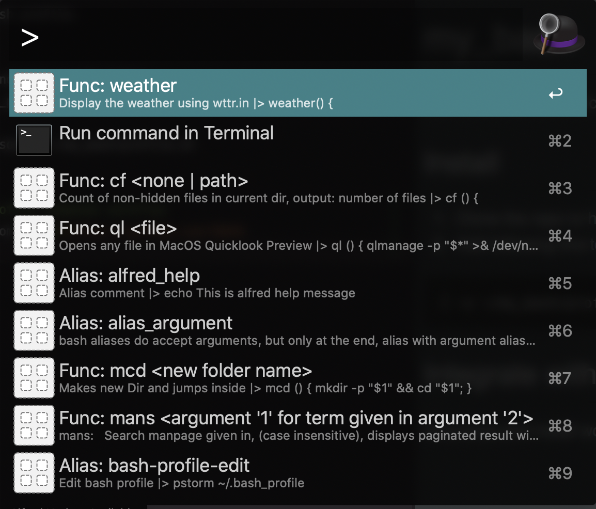

# Alfred bash profile workflow
This workflow enable Alfred run alias or functions that come from ~/.bash_profile and ~/my_bash/profile.sh ([Common bash profile alias and functions](https://github.com/186dk/my_bash)).

## Install
Download and install the workflow in alfred.

## Run
Type > 

The workflow will auto display alias and functions from bash_profile. E.g.


## Add custom comment for alfred to read
You may need to add comment tags for your alias or functions in .bash_profile for alfred to read with following format:

```bash
#alfred; command: XXX ; parameters: XXX or 'none', ('none' means no parameter); description: XXX
```
Where keyword

'command' is alias or function name.  
'parameters' is alias or function parameters. If it doesn't have parameters, you need to give 'none'.   
'description' is alias or function description.

## Note
0. If there has duplicate alias or function names, Alfred only display first one.
0. Custom comment tag has higher priority then alias and functions.
0. Support display recommendations from keyword in camelcase, underscore and hyphen.
0. Add comment and parameter hint in alias functions as following:
    ```
    # Moves a file to the MacOS trash
    # parameters: path (or var: path | none)
    trash () { command mv "$@" ~/.Trash ; }
    ```
 0. Can use parameter, parameters, var as parameter keyword
 0. If there has function inside function, the inner function need start with _ for ignoring indexing in alfred.
## Test
In workflow source folder, run command: 
```php
# display alfred workflow output
php run.php help

# run some tests
php test.php 
```
